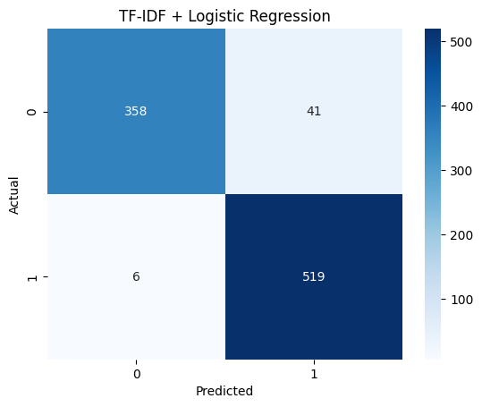
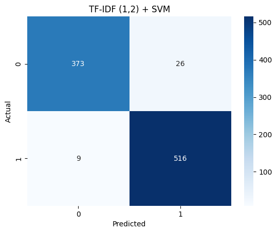
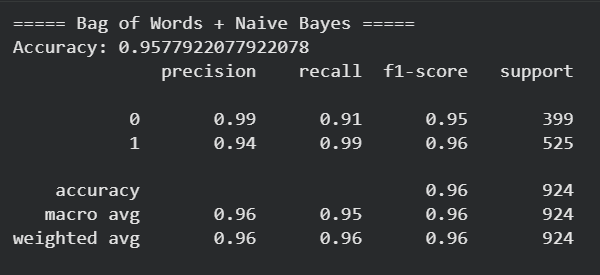
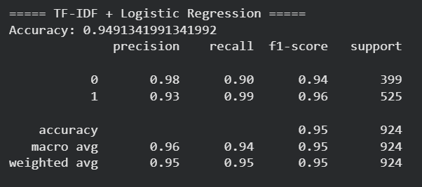

# Sport vs Politics Text Classification

## 📌 Project Overview

This project implements a binary text classification system that classifies documents as either **Sport** or **Politics** using traditional Machine Learning techniques.

Three feature extraction techniques and three classifiers were compared:

- Bag of Words + Naive Bayes
- TF-IDF + Logistic Regression
- TF-IDF (1,2) n-grams + Support Vector Machine (SVM)

The best performing model achieved **96.21% accuracy**.

---

## 📊 Dataset

The dataset used is a subset of the 20 Newsgroups dataset available via Scikit-Learn.

Selected categories:

- rec.sport.baseball  
- rec.sport.hockey  
- talk.politics.misc  
- talk.politics.guns  
- talk.politics.mideast  

These were merged into two final classes:

- 0 → Sport  
- 1 → Politics  

### Dataset Statistics

- Total Documents: 4618  
- Sports Documents: 1993  
- Politics Documents: 2625  

---

## ⚙️ Methodology

### 1️⃣ Feature Representations

- Bag of Words
- TF-IDF
- TF-IDF with (1,2) n-grams

### 2️⃣ Machine Learning Models

- Multinomial Naive Bayes
- Logistic Regression
- Linear Support Vector Machine

### 3️⃣ Train-Test Split

- 80% Training
- 20% Testing
- Stratified sampling used

---

## 📈 Results

| Model | Accuracy |
|-------|----------|
| BoW + Naive Bayes | 95.78% |
| TF-IDF + Logistic Regression | 94.91% |
| TF-IDF (1,2) + SVM | **96.21%** |

---

## 🔍 Confusion Matrices

### BoW + Naive Bayes


### TF-IDF + Logistic Regression


### TF-IDF (1,2) + SVM


---

## 📑 Classification Reports

### Naive Bayes


### Logistic Regression


### SVM


---

## 🚀 How to Run

### 1. Clone Repository

```bash
git clone https://github.com/aditya-padhy/Sport-vs-Politics-Text-Classification
cd Sport-vs-Politics-Text-Classification
